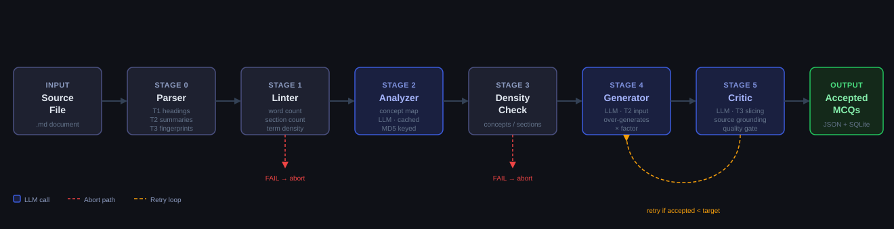

# MCQ Pipeline

> **Returning after a break?** Jump to [Quick-Start Checklist](#0-quick-start-checklist).

An LLM-powered pipeline that transforms Markdown lesson files into production-quality multiple-choice questions. Ships with a full-featured Electron desktop GUI for operators who prefer a graphical interface, and a Python CLI for scripted/batch use.

---

## Table of Contents

0. [Quick-Start Checklist](#0-quick-start-checklist)
1. [What This Project Does](#1-what-this-project-does)
2. [System Architecture](#2-system-architecture)
   - 2.1 [Component Overview](#21-component-overview)
   - 2.2 [Pipeline Data Flow](#22-pipeline-data-flow)
   - 2.3 [GUI Architecture](#23-gui-architecture)
   - 2.4 [Two-Store Data Architecture](#24-two-store-data-architecture)
3. [Environment Setup](#3-environment-setup)
   - 3.1 [Prerequisites](#31-prerequisites)
   - 3.2 [Python Environment](#32-python-environment)
   - 3.3 [API Keys (.env)](#33-api-keys-env)
   - 3.4 [GUI Setup (Node.js)](#34-gui-setup-nodejs)
   - 3.5 [Verify the Install](#35-verify-the-install)
4. [Running the Application](#4-running-the-application)
   - 4.1 [CLI](#41-cli)
   - 4.2 [Electron GUI](#42-electron-gui)
5. [Configuration Reference](#5-configuration-reference-configyaml)
6. [LLM Providers](#6-llm-providers)
7. [The Pipeline — Stage by Stage](#7-the-pipeline--stage-by-stage)
8. [Storage: SQLite + Supabase](#8-storage-sqlite--supabase)
9. [GUI Tab Reference](#9-gui-tab-reference)
10. [Module Reference](#10-module-reference)
11. [Data Models](#11-data-models)
12. [CLI Reference](#12-cli-reference)
13. [Output Files](#13-output-files)
14. [Production-Grade Engineering](#14-production-grade-engineering)
15. [Quality Rules — Design Rationale](#15-quality-rules--design-rationale)
16. [Troubleshooting](#16-troubleshooting)

---

## 0. Quick-Start Checklist

Use this every time you return to the project after a break.

```
[ ] 1. Open terminal in:  C:\Users\Akash\Documents\mcq_pipeline

[ ] 2. Activate Python environment:
        PowerShell:       .\.venv\Scripts\Activate.ps1
        Prompt shows (.venv) when active.

[ ] 3. CLI smoke test:
        python -m pytest tests/ -v

[ ] 4. Generate questions (CLI):
        mcq-agent generate examples/sample_lesson.md --count 3

[ ] 5. Launch GUI (separate terminal, no venv needed):
        cd gui
        npm run dev
        # Electron window opens automatically
```

---

## 1. What This Project Does

The **MCQ Agent** is an AI-powered pipeline that transforms Markdown lesson files into high-quality Multiple-Choice Questions ready for use in courses. Given a `.md` file, it:

1. Analyses the document and extracts a structured **concept map** (concepts, procedures, facts, code examples)
2. Generates MCQ candidates covering the lesson's key ideas using per-Bloom-level compressed document summaries
3. Runs every candidate through **7 deterministic rule checks** (free, no API cost)
4. Evaluates each candidate against **13 quality criteria** via an independent LLM Critic
5. Salvages borderline rejections through targeted rewrites (**Reframer**, 5-class taxonomy)
6. Stores all results in a local SQLite database and optionally syncs a deduplicated set to Supabase cloud

The Electron GUI provides a graphical operator interface over the same pipeline and question bank — run generation, browse/filter questions, export DOCX/PDF/JSON, monitor costs, curate eval sets, and adjust model config, all without touching the command line.

**What it is NOT:** a simple "ask GPT to write questions" script. Every MCQ must pass deterministic validators, an independent LLM critic, and a class-based reframer before it is accepted. A deduplication gate prevents re-generating questions already in the bank.

---

## 2. System Architecture

### 2.1 Component Overview

```
┌─────────────────────────────────────────────────────────────────────────────┐
│                          MCQ Pipeline — System Map                           │
│                                                                               │
│  ┌──────────────────────────────────────┐  ┌──────────────────────────────┐ │
│  │       Electron Desktop GUI (gui/)     │  │   Python CLI (mcq_agent/)    │ │
│  │                                       │  │                               │ │
│  │  React + Vite renderer (5 tabs)       │  │  mcq-agent generate <file>    │ │
│  │  ◄──contextBridge──► Electron main   │  │  mcq-agent list-runs          │ │
│  │  Electron main spawns Python sidecar  │  │  mcq-agent show-run <id>      │ │
│  │  GUI reads DB via sql.js (WASM)       │  │  mcq-agent push-supabase      │ │
│  │  Python owns all DB writes            │  │                               │ │
│  └────────────────┬─────────────────────┘  └──────────────┬────────────────┘ │
│                   │ spawns                                  │                  │
│  ┌────────────────▼─────────────────────────────────────── ▼ ───────────────┐ │
│  │                     Python Pipeline (mcq_agent/)                          │ │
│  │                                                                            │ │
│  │  Parse ──► Analyze ──► Generate ──► Validate ──► Critique ──► Reframe    │ │
│  │   T1/T2/T3   ConceptMap  per-Bloom    7 rules    13 criteria  5 classes  │ │
│  │   tiers      MD5 cache   fan-out      free        LLM judge   LLM fix    │ │
│  │                                                                            │ │
│  │  instructor + Pydantic v2 enforces structured output at every LLM stage  │ │
│  └────────────────────────────────┬───────────────────────────────────────── ┘ │
│                                    │ writes                                   │
│  ┌─────────────────────────────────▼──────────────────────────────────────┐  │
│  │  logs/runs.db  (SQLite — Python writes, GUI reads via sql.js WASM)      │  │
│  │  runs · mcqs (passed + rejected) · concept_maps (analyzer cache)        │  │
│  └─────────────────────────────────┬──────────────────────────────────────┘  │
│                                     │ optional dedup sync                     │
│  ┌──────────────────────────────────▼─────────────────────────────────────┐  │
│  │  Supabase (cloud — optional)                                             │  │
│  │  accepted + deduplicated questions only · gapless question_number        │  │
│  │  token_set_ratio dedup gate (rapidfuzz) · service_role key via Python    │  │
│  └────────────────────────────────────────────────────────────────────────┘  │
│                                                                                │
│  ┌────────────────────────────────────────────────────────────────────────┐  │
│  │  eval-sets/  (JSON files — GUI-owned annotation data)                   │  │
│  │  EvalSet · EvalAnnotation (ratings, confirmed flag, notes)              │  │
│  └────────────────────────────────────────────────────────────────────────┘  │
└─────────────────────────────────────────────────────────────────────────────┘
```

### 2.2 Pipeline Data Flow

```
Input (.md file)
       │
       ▼
┌──────────────────────────────────────┐
│  parser.py — Stage 0                 │
│  Three document tiers in one read:   │
│  T1: raw_text   (full Markdown)      │ ◄─ Analyzer only (once, then cached)
│  T2: section_summaries               │ ◄─ Generator, Reframer (~30–60% of T1)
│  T3: section_fingerprints            │ ◄─ Critic source-slicing (~5–10% of T1)
└───────────────┬──────────────────────┘
                │
                ▼
┌──────────────────────────────────────┐
│  source_linter.py — Layer 1 (FREE)   │
│  word count · sections · code density│  FAIL → abort before any API call
└───────────────┬──────────────────────┘
                │
                ▼
┌──────────────────────────────────────┐
│  analyzer.py — Stage 1               │  Premium model · runs ONCE · cached
│  MD5(source) → SQLite cache check    │  Cache hit = 0 tokens, ~0ms
│  Cache miss → LLM → ConceptMap       │
└───────────────┬──────────────────────┘
                │
                ▼
┌──────────────────────────────────────┐
│  source_linter.py — Layer 2 (FREE)   │
│  concept density · procedural rich.  │  FAIL → abort
└───────────────┬──────────────────────┘
                │
       ┌────────▼──────────────────────────────────────────────────┐
       │  GUARANTEE-N RETRY LOOP  (up to guarantee_n_retries)       │
       │                                                             │
       │  ┌──────────────────────────────────────────────────────┐  │
       │  │  generator.py — Stage 2                              │  │
       │  │  One LLM call per active Bloom level (fan-out)       │  │
       │  │  Each call uses its own bloom_temperatures[level]    │  │
       │  │  Generates n × over_generation_factor candidates     │  │
       │  └────────────────────┬─────────────────────────────────┘  │
       │                       │                                     │
       │  ┌────────────────────▼─────────────────────────────────┐  │
       │  │  validators.py — 7 deterministic checks (FREE)       │  │
       │  │  source grounding · uniqueness · option count        │  │
       │  │  length parity · bloom/difficulty · source phrases   │  │
       │  └────────────────────┬─────────────────────────────────┘  │
       │                       │                                     │
       │  ┌────────────────────▼─────────────────────────────────┐  │
       │  │  critic.py — Stage 3                                 │  │
       │  │  T3 fingerprints → find relevant source section      │  │
       │  │  LLM evaluates against 13 quality criteria           │  │
       │  └─────────┬───────────────────────┬────────────────────┘  │
       │          PASS                    FAIL                       │
       │            │              ┌────────▼─────────────────────┐  │
       │            │              │  reframer.py — Stage 4       │  │
       │            │              │  Classify → A/B/C/D/E/SKIP   │  │
       │            │              │  Targeted fix → re-validate  │  │
       │            │              └────────┬─────────────────────┘  │
       │            │                    PASS / FAIL                  │
       │            └──────────┬───────────────────────────────────  │
       │              accepted >= target? → exit · else next retry   │
       └───────────────────────────────────────────────────────────--┘
                │
                ▼
┌──────────────────────────────────────┐
│  supabase_gate.py (if enabled)        │  token_set_ratio dedup · renumber
│  fetch existing → similarity filter  │  idempotent push (skip dup run_id)
└───────────────┬──────────────────────┘
                │
                ▼
        logs/runs.db (SQLite)       output/ JSON files (4 per run)
```

**Token efficiency — why the tiered approach matters:**

| Stage | Naïve (full doc every call) | Tiered (T1/T2/T3) | Saving |
|---|---|---|---|
| Analyzer | 5 000 tok × every run | 5 000 tok × 1, then 0 | 100% on repeats |
| Generator input (10 MCQs) | ~50 000 tok | ~15 000 tok | ~70% |
| Critic input per MCQ | ~5 000 tok | ~600 tok | ~88% |
| **Total for 10 MCQs** | **~105 000 tok** | **~27 500 tok** | **~74%** |

### 2.2.1 Pipeline Stage Diagram

The diagram below shows every stage of the MCQ generation pipeline left-to-right, including the two linter abort gates and the Generator → Critic retry loop.



| Stage | Name | Cost | Description |
|---|---|---|---|
| 0 | **Parser** | Free | Splits source `.md` into T1 (headings), T2 (section summaries), T3 (fingerprints) |
| 1 | **Linter L1** | Free | Static checks — word count, section count, term density. FAIL aborts before any API call. |
| 2 | **Analyzer** | LLM × 1 | Extracts a full concept map. Result is MD5-keyed in SQLite — cache hit costs 0 tokens. |
| 3 | **Density Check** | Free | Post-analyzer gate: `concepts / sections ≥ 0.2`. FAIL aborts. |
| 4 | **Generator** | LLM × N | Over-generates candidates using T2 summaries. Repeats per Bloom level when per-Bloom mode is on. |
| 5 | **Critic** | LLM × 1/MCQ | Evaluates each candidate against 13 quality criteria using T3 source slices. |
| ↺ | **Retry loop** | — | Generator + Critic repeat until `accepted ≥ target` or `guarantee_n_retries` exhausted. |

### 2.3 GUI Architecture

```
┌──────────────────────────────────────────────────────────────────────────────┐
│                         Electron App  (gui/)                                  │
│                                                                                │
│  ┌─────────────────────────────────────────────────────────────────────────┐ │
│  │  Renderer Process  (Vite + React 18 + TypeScript)                        │ │
│  │                                                                           │ │
│  │  App.tsx                                                                  │ │
│  │   ├─ NavRail  (64 px icon rail — Zustand activeTab)                      │ │
│  │   ├─ StatusBar  (SQLite row counts · model routing · session cost)        │ │
│  │   └─ Tab pane  (lazy-rendered on nav)                                     │ │
│  │       ├─ ModelTab     6 config sections · profile save/load · YAML write  │ │
│  │       ├─ DashboardTab 4 sub-tabs: Overview · Quality · Cost · History     │ │
│  │       ├─ FilesTab     graphical SQL query · card/table views · export     │ │
│  │       ├─ RunTab       upload → linter → config → live timeline + feed     │ │
│  │       └─ EvalSetTab   create/annotate/export question eval sets           │ │
│  │                                                                           │ │
│  │  State: Zustand store (activeTab · runState · dbReady)                   │ │
│  │  Charts: Recharts 3.x (7 chart components)                               │ │
│  │  Icons: Lucide-React                                                      │ │
│  └──────────────────────────────────────┬────────────────────────────────── ┘ │
│            contextBridge  (preload.ts — window.api — FROZEN contract)        │
│  ┌──────────────────────────────────────▼────────────────────────────────── ┐ │
│  │  Main Process  (Electron Node.js)                                         │ │
│  │                                                                            │ │
│  │  ipc.ts        30+ ipcMain.handle handlers (namespaced: db / run /        │ │
│  │                config / lint / export / evalset / supabase / file)        │ │
│  │  db.ts         sql.js WASM snapshot · reload() after runs · read-only    │ │
│  │  sidecar.ts    spawn Python · readline NDJSON stream · forward events     │ │
│  │  modelConfig.ts YAML Document setIn · comment-preserving config writes    │ │
│  │  export.ts     JSON builder · docx npm · PDF via hidden BrowserWindow     │ │
│  │  evalset.ts    eval-sets/ JSON CRUD (list / load / save / delete)         │ │
│  │  outputs.ts    reads output/*_run_config.json for per-stage token data    │ │
│  │  lint.ts       Layer-1 linter via Python sidecar (--json flag)            │ │
│  │  paths.ts      resolvePython(): MCQ_PYTHON env → .venv → PATH            │ │
│  └──────────────────────────────────────┬────────────────────────────────── ┘ │
│                                          │ spawn(python -m mcq_agent.cli)      │
│  ┌───────────────────────────────────────▼────────────────────────────────── ┐ │
│  │  Python Sidecar  (mcq_agent.cli --json-events)                            │ │
│  │                                                                             │ │
│  │  NDJSON event stream on stdout → readline → ipcRenderer 'pipeline:event'  │ │
│  │  Events: stage_start · stage_done · question_accepted · question_rejected  │ │
│  │           run_complete · error · linter_result                             │ │
│  └─────────────────────────────────────────────────────────────────────────── ┘ │
└──────────────────────────────────────────────────────────────────────────────┘
```

### 2.4 Two-Store Data Architecture

```
                         Python Pipeline writes
                                  │
                                  ▼
┌──────────────────────────────────────────────────────────┐
│             logs/runs.db  (SQLite — audit log)            │
│                                                           │
│  runs          ─ every pipeline execution, config snap   │
│  mcqs          ─ ALL questions: accepted (passed=1)       │
│                  AND rejected (passed=0) with critique    │
│  concept_maps  ─ MD5-keyed ConceptMap cache              │
│                                                           │
│  GUI reads via sql.js WASM (no native build needed)       │
│  Python owns all writes; GUI reads are snapshot-safe      │
└────────────────────────────┬─────────────────────────────┘
                             │
                   supabase_gate.py (optional)
                   ┌─────────┴────────────────┐
                   │  1. Fetch all existing    │
                   │  2. token_set_ratio dedup │
                   │  3. Renumber survivors    │
                   │  4. Idempotent push       │
                   └─────────┬────────────────┘
                             │
┌────────────────────────────▼─────────────────────────────┐
│            Supabase  (cloud — optional)                   │
│                                                           │
│  Only accepted + deduplicated questions                   │
│  Gapless sequential question_number                       │
│  Promoted columns: difficulty · bloom_level · source      │
│  v_questions view for fast navigation queries             │
└───────────────────────────────────────────────────────────┘
```

---

## 3. Environment Setup

### 3.1 Prerequisites

**Python stack (required for both CLI and GUI):**

| Requirement | Notes |
|---|---|
| Python 3.10+ | `python --version` |
| pip | Bundled with Python 3.10+ |
| At least one LLM API key | OpenRouter recommended |

**GUI stack (required only to run the Electron desktop app):**

| Requirement | Version | Check |
|---|---|---|
| Node.js | 18 LTS or 20 LTS | `node --version` |
| npm | 9+ (bundled with Node 18) | `npm --version` |

API keys: [OpenRouter](https://openrouter.ai/keys) · [Groq](https://console.groq.com/keys) · [Anthropic](https://console.anthropic.com)

---

### 3.2 Python Environment

**Recommended — run the setup script:**

```powershell
# PowerShell
.\setup_venv.ps1

# Command Prompt
setup_venv.bat
```

Both scripts do the following automatically (safe to re-run):
1. Check Python ≥ 3.10
2. Create `.venv/` virtual environment
3. Upgrade pip
4. Install all packages from `requirements.txt`
5. Install the `mcq-agent` CLI in editable mode (`pip install -e .`)
6. Copy `.env.example` → `.env` if `.env` doesn't exist
7. Create `output/` and `logs/` directories
8. Run smoke tests to verify the install

**Manual alternative:**

```powershell
python -m venv .venv
.\.venv\Scripts\Activate.ps1          # PowerShell
pip install --upgrade pip
pip install -r requirements.txt
pip install -e .
New-Item -ItemType Directory -Force output, logs
python -m pytest tests/ -v
```

**Activate at the start of every Python session:**

```powershell
.\.venv\Scripts\Activate.ps1       # PowerShell — prompt shows (.venv)
```

---

### 3.3 API Keys (.env)

Open `.env` (created by setup script from `.env.example`) and fill in the key for your provider:

```env
# OpenRouter (current default — one key for all models):
OPENROUTER_API_KEY=sk-or-your-real-key-here

# Groq (if switching to groq provider):
GROQ_API_KEY=gsk_your-real-key-here

# Anthropic (if switching to anthropic provider):
ANTHROPIC_API_KEY=sk-ant-your-real-key-here

# Supabase (only if enable_supabase: true in config.yaml):
SUPABASE_URL=https://your-project-id.supabase.co
SUPABASE_KEY=eyJhbGci...   # Secret (service_role) key — NOT the anon key
```

You only need the key for the `provider:` value currently set in `config.yaml`.

---

### 3.4 GUI Setup (Node.js)

The GUI is a separate Node project in `gui/`. It requires Node.js 18 or 20 LTS.

```powershell
cd gui
npm install
```

That's it — no further build step needed for development. The `npm run dev` command below handles the rest.

> **Windows extract quirk:** If Electron's installer silently fails mid-extract (leaving only `LICENSES.chromium.html`), fix it without re-downloading:
>
> ```powershell
> $zip = Get-ChildItem "$env:LOCALAPPDATA\electron\Cache" -Recurse -Filter *.zip | Select -First 1
> Remove-Item -Recurse -Force node_modules\electron\dist
> Expand-Archive $zip.FullName node_modules\electron\dist -Force
> Set-Content node_modules\electron\path.txt "electron.exe" -NoNewline -Encoding ascii
> ```

The GUI resolves Python automatically via `paths.ts`:
1. `MCQ_PYTHON` environment variable (if set)
2. `.venv/Scripts/python.exe` (Windows) or `.venv/bin/python` (Unix) inside the repo root
3. `python` on `PATH` as fallback

**You do not need to activate the Python venv before launching the GUI** — as long as `.venv/` exists in the repo root, the GUI finds it automatically.

---

### 3.5 Verify the Install

```powershell
# Python CLI
mcq-agent --help
python -m pytest tests/ -v          # 5 smoke tests, no API calls
mcq-agent generate examples/sample_lesson.md --count 3

# GUI
cd gui
node -e "console.log(require('electron'))"   # should print the exe path
npm run build                                  # TypeScript + Vite build check
```

---

## 4. Running the Application

### 4.1 CLI

```powershell
# Activate venv first
.\.venv\Scripts\Activate.ps1

# Generate questions from a Markdown file
mcq-agent generate path/to/lesson.md

# Common options
mcq-agent generate lesson.md --count 20 --difficulty hard
mcq-agent generate lesson.md --count 10 --topic "MQTT Protocol"
mcq-agent generate lesson.md --config configs/groq_config.yaml

# View history
mcq-agent list-runs
mcq-agent list-runs --limit 5

# Inspect a run
mcq-agent show-run <run-uuid>
mcq-agent show-run <first-8-chars>     # short ID works

# Push to Supabase cloud (requires enable_supabase: true + keys in .env)
mcq-agent push-supabase --latest
mcq-agent push-supabase --latest --dry-run
```

Output is written to `output/` (4 files per run — see [§13 Output Files](#13-output-files)).

---

### 4.2 Electron GUI

```powershell
cd gui

# Development (hot-reload Vite + Electron)
npm run dev
# Opens the Electron window automatically.
# Edit any src/ file → Vite HMR reloads the renderer without restarting.

# Production build
npm run build
# Outputs: gui/dist/ (renderer) + gui/dist-electron/ (main process)
# Run with: npx electron .   (from gui/ directory)
```

**What the GUI requires at runtime:**
- `logs/runs.db` — SQLite database (auto-created by the Python pipeline on first run)
- `config.yaml` — pipeline configuration (at the repo root)
- `.venv/` — Python virtual environment for the sidecar
- `output/` — pipeline output files (for per-stage token data in Dashboard)
- `eval-sets/` — eval set JSON files (auto-created by the GUI on first use)

The status bar at the bottom of every screen shows the current DB row counts, model routing, and session cost. If the DB doesn't exist yet (`logs/runs.db` missing), the GUI shows a setup hint.

---

## 5. Configuration Reference (config.yaml)

All runtime settings live in `config.yaml` in the project root. Changes take effect immediately on the next run — no restart needed. The **Model tab** in the GUI provides a graphical editor for this file with live validation and comment-preserving writes.

```yaml
# ── LLM Provider ──────────────────────────────────────────────────────────
provider: openrouter           # anthropic | groq | openrouter
model: google/gemini-2.5-flash

# Per-stage overrides. null → falls back to global model.
analyzer_provider: openrouter
analyzer_model: google/gemini-2.5-flash
generator_provider: openrouter
generator_model: google/gemini-2.5-flash
critic_provider: openrouter
critic_model: google/gemini-2.5-flash

# ── Question Generation ────────────────────────────────────────────────────
num_questions: 10              # Target accepted questions
difficulty: medium             # easy | medium | hard | expert
question_type: single_correct  # single_correct | ordering | code_snippet
num_options: 4                 # Options per question (3–6)
over_generation_factor: 2.0    # Generate 2× the target for the critic to filter
mixed_question_types: true     # Mix single_correct, ordering, code_snippet

# ── Quality Control ────────────────────────────────────────────────────────
source_grounding_threshold: 0.65   # fuzzy-match ratio (0–1)
guarantee_n_retries: 20            # full Generator+Critic loops before giving up

# ── Token Budgets Per Stage ────────────────────────────────────────────────
max_tokens: 32000
critic_max_tokens: 4000
analyzer_max_tokens: 20000

# ── LLM Temperatures ──────────────────────────────────────────────────────
temperature: 0.7               # Generator fallback
critic_temperature: 0.2
analyzer_temperature: 0.2

# Per-Bloom-level temperatures for the Generator fan-out
bloom_temperatures:
  remember: 0.5
  understand: 0.6
  apply: 0.7
  analyze: 0.7
  evaluate: 0.8
  create: 0.9

# ── Source Linter Thresholds ───────────────────────────────────────────────
linter_min_words: 300
linter_min_sections: 2
linter_min_words_per_section: 50
linter_min_concept_density: 0.3
linter_fail_on_warn: false

# ── Retry / Rate Limit ────────────────────────────────────────────────────
api_max_retries: 3
api_retry_initial_backoff: 2.0

# ── Pricing (for cost reporting only) ─────────────────────────────────────
pricing:
  input_per_million_tokens: 0.15
  output_per_million_tokens: 0.60
generator_pricing:
  input_per_million_tokens: 0.15
  output_per_million_tokens: 0.60
critic_pricing:
  input_per_million_tokens: 0.15
  output_per_million_tokens: 0.60

# ── Cloud Storage ─────────────────────────────────────────────────────────
enable_supabase: false
supabase_similarity_threshold: 80  # 0–100; lower = stricter dedup

# ── Output ────────────────────────────────────────────────────────────────
output_format: json
include_rejected_in_output: false

# ── Paths ─────────────────────────────────────────────────────────────────
log_db_path: logs/runs.db
prompts_dir: prompts
few_shot_examples_file: prompts/few_shot_examples.json
```

**Common config adjustments:**

| Goal | Change |
|---|---|
| More questions | `num_questions: 50`; raise `guarantee_n_retries` |
| Fewer grounding failures | Lower `source_grounding_threshold` to `0.55–0.60` |
| Premium Analyzer only | `analyzer_model: anthropic/claude-opus-4-8` |
| Switch to Groq | Change all `*_provider` to `groq`, update model IDs |
| Stricter dedup | Lower `supabase_similarity_threshold` to `70` |

---

## 6. LLM Providers

| Provider | Env var | Model format | Example | Cost |
|---|---|---|---|---|
| OpenRouter | `OPENROUTER_API_KEY` | `provider/model-name` | `google/gemini-2.5-flash` | Very cheap |
| Groq | `GROQ_API_KEY` | plain model ID | `llama-3.3-70b-versatile` | Free tier |
| Anthropic | `ANTHROPIC_API_KEY` | plain model ID | `claude-sonnet-4-6` | Medium |

**OpenRouter** gives access to hundreds of models under one key — Gemini, Claude, GPT-4o, Llama, Mistral. Recommended for production.

### Model selection guide

| Stage | Priority | Recommended |
|---|---|---|
| Analyzer | Quality > Speed > Cost — runs once, cached | `claude-opus-4-8`, `gpt-4o`, `gemini-2.5-flash` |
| Generator | Quality + instruction-following | `gemini-2.5-flash`, `llama-4-scout`, `claude-sonnet-4-6` |
| Critic | Speed > Cost — runs once per MCQ | `llama-3.1-8b-instant`, `gemini-2.5-flash` |

### Example: cost-optimised mixed config

```yaml
provider: openrouter
analyzer_provider: anthropic
analyzer_model: claude-opus-4-8       # premium once, then cached
generator_provider: openrouter
generator_model: google/gemini-2.5-flash
critic_provider: groq
critic_model: llama-3.1-8b-instant    # fastest for per-MCQ eval
```

---

## 7. The Pipeline — Stage by Stage

### Stage 0 — Parse

**File:** `mcq_agent/parser.py`

Reads the `.md` file once and builds all three document tiers:

- **T1 `raw_text`** — verbatim file content. Only the Analyzer uses this.
- **T2 `section_summaries`** — first 3 sentences of prose + all code blocks per section. ~30–60% of T1 tokens. Generator and Reframer use this.
- **T3 `section_fingerprints`** — section heading + top-20 key terms (stop-words removed). ~5–10% of T1. Critic source-slicing uses this.

The parser also extracts section hierarchy, tables, and code blocks for structural metadata.

---

### Stage 1 — Analyze

**File:** `mcq_agent/analyzer.py`

Sends T1 (full document) to the LLM and extracts a `ConceptMap` — a structured knowledge graph.

**Caching:** Computes the MD5 hash of the source file, queries SQLite `concept_maps` table. Cache hit → instant return at zero token cost. Cache is permanent — run against the same file a hundred times, pay the LLM once.

**Temperature:** 0.2 — deterministic extraction.

A `ConceptMap` contains concepts (with testability score 1–5, confusion pairs for distractor replacement), procedures, technical facts, code examples, thematic clusters, and prerequisite chains.

---

### Stage 2 — Generate

**File:** `mcq_agent/generator.py`

Takes T2 + compact `ConceptMap` (sorted by testability score) and generates MCQ candidates.

**Per-Bloom fan-out:** Generation fans across every Bloom level the source actually supports (union of all concepts' `supported_bloom_levels`). Each level gets its own LLM call at its own temperature from `bloom_temperatures`. The target question count is split evenly across active levels; any remainder goes to levels backed by the most concepts. Sources with no declared Bloom levels fall back to a single call at the global `temperature`.

**Mixed types:** With `mixed_question_types: true`, distributes across `single_correct`, `ordering`, and `code_snippet`. Higher-order type hints are suppressed for `remember`/`understand` batches where they don't fit.

Each candidate includes: question stem, 4 options with `is_correct` + `distractor_rationale`, `explanation`, `source_excerpt`, `source_heading`, `bloom_level`, `difficulty`, `question_type`, `stem_pattern`.

---

### Stage 3 — Critique

**File:** `mcq_agent/critic.py`

Each MCQ is evaluated independently. The Critic does NOT see other candidates.

**Source slicing** (avoids sending the full document): finds the relevant section via T3 fingerprints — first by `source_heading` substring match, then by `source_excerpt` prefix match, then by `rapidfuzz.partial_ratio` against key terms. No full-document fallback — if no match, the question fails automatically.

**The 13 quality criteria:**

| # | Criterion |
|---|---|
| a | Source grounding (excerpt matches document) |
| b | Unique correct answer |
| c | Factual accuracy |
| d | Distractor plausibility |
| e | Stem clarity |
| f | Bloom level matches declared difficulty |
| g | Explanation quality |
| h | Source heading accuracy |
| i | Stem economy (no non-load-bearing context) |
| j | Option length parity |
| k | Source-phrase independence |
| l | Distractor rationale present for all wrong options |
| m | No option immediately eliminable as absurd |

---

### Stage 4 — Reframe

**File:** `mcq_agent/reframer.py`

Classifies the failure and applies the minimum intervention rather than discarding the question.

| Class | Failure | Fix |
|---|---|---|
| A | Length parity — correct answer >30% longer | Expand distractors using ConceptMap confusion pairs |
| B | Source excerpt doesn't match document | Re-ground: find verbatim excerpt from source section |
| C | Distractors implausible or ungrounded | Replace using ConceptMap confusion pairs |
| D | Correct answer contains unsourced claims | Trim to source-supported content only |
| E | Both B and A fail | Fix B first, then A |
| SKIP | Structural failure (option count, duplicates) | Not reframeable — rejected |

After fix: re-validates + re-critiques. Pass → accepted. Fail again → rejected.

---

### Quality Gates

**Validators (`validators.py`) — 7 deterministic checks, all run (no short-circuit):**

| # | Check | What it catches |
|---|---|---|
| 1 | `source_grounding` | fuzzy-match score < threshold |
| 2 | `uniqueness` | wrong correct option count |
| 3 | `option_count` | doesn't match `num_options` |
| 4 | `distractor_rationales` | missing rationale on any wrong option |
| 5 | `bloom_difficulty_alignment` | Bloom inconsistent with difficulty |
| 6 | `length_parity` | correct answer >30% longer than median distractor |
| 7 | `source_phrase_overlap` | 5-gram verbatim copy from excerpt |

`shuffle_correct_answer_positions()` randomly reassigns A/B/C/D labels after generation — eliminates LLM position bias mechanically.

**Source Linter (`source_linter.py`) — Layer 1 (static) + Layer 2 (post-Analyzer):**

FAIL on any check aborts the run before spending further tokens. WARN continues unless `linter_fail_on_warn: true`.

---

### Guarantee-N Retry Loop

Runs Generator → Validators → Critic → Reframer in a loop until:
- `accepted_count >= num_questions`, **or**
- `guarantee_n_retries` iterations exhausted

Each iteration requests only the remaining **deficit** — if 7/10 passed, asks for 3 more. Always tries to hit the target exactly.

---

## 8. Storage: SQLite + Supabase

### SQLite (local — always active)

**Location:** `logs/runs.db` · **Module:** `mcq_agent/storage.py`

| Table | Key columns |
|---|---|
| `runs` | `run_id` (UUID) · `timestamp` · `input_file` · `config_json` · `passed_count` · `cost_usd` · `generation_number` |
| `mcqs` | `id` · `run_id` · `mcq_json` · `passed` (1/0) · `critique_json` · `question_number` |
| `concept_maps` | `file_hash` (MD5) · `source_file` · `concept_map_json` |

```powershell
# Useful raw queries
sqlite3 logs/runs.db "SELECT run_id, timestamp, passed_count, cost_usd FROM runs;"
sqlite3 logs/runs.db "SELECT COUNT(*) FROM mcqs WHERE passed=1;"
sqlite3 logs/runs.db "DELETE FROM concept_maps;"   # clear analyzer cache
```

### Concept Map Cache

1. MD5(source file content) → query `concept_maps`
2. **Hit** → return cached ConceptMap instantly. Zero tokens.
3. **Miss** → call LLM, save with `INSERT OR REPLACE`

Same content always hits the cache regardless of file rename or move.

### Supabase (cloud — optional)

Purpose: a clean, deduplicated cloud question bank. Unlike SQLite (everything including rejects), Supabase stores only accepted, deduplicated questions with gapless sequential numbering.

**Setup:**
1. Create project at https://supabase.com
2. SQL Editor → run `supabase_schema.sql`
3. Copy **Project URL** → `SUPABASE_URL` in `.env`
4. Copy **Secret (service_role)** key → `SUPABASE_KEY` in `.env` (NOT the anon key)
5. `config.yaml`: `enable_supabase: true`

**Verify:** `python migrate_to_supabase.py --latest --dry-run`

### Deduplication Algorithm

1. Fetch all existing questions from Supabase (paginated, batches of 1000)
2. Composite text per question = stem + all option texts
3. `rapidfuzz.fuzz.token_set_ratio` against every existing composite text
4. Score ≥ `supabase_similarity_threshold` (default 80%) → dropped
5. Intra-batch dedup: new questions also checked against each other
6. Survivors renumbered from `max(existing) + 1`
7. Push is idempotent — `run_id` already present → skip

**Why `token_set_ratio`:** order-insensitive, catches paraphrasing ("Which tool builds X?" vs "What tool is used to build X?").

---

## 9. GUI Tab Reference

| Tab | Icon | What it does |
|---|---|---|
| **Model** | Sliders | Graphical editor for `config.yaml` — 6 sections (provider, generation, quality, tokens, temperatures, linter). Profile save/load. Non-destructive YAML writes that preserve user comments. |
| **Dashboard** | BarChart | 4 sub-tabs: **Overview** (KPI strip + 4 charts: questions/gen, type donut, cost/run, difficulty), **Quality** (validator failure bar, reframer-class pie, Critic criteria heatmap, source-linter stats), **Cost & Tokens** (cumulative cost + forecast, cache-hit rate, token-usage stacked bar, cost/question scatter), **Run History** (sortable table + per-run Inspect drawer + JSON export). |
| **Files** | Database | Graphical SQL query builder (difficulty · bloom · question type · source file · heading · date range · pass-only toggle). Card and table result views. Export to **JSON / DOCX / PDF**. DB management panel (SQLite health, concept-cache clear, Supabase push). |
| **Run** | Play | Upload `.md` file → Layer-1 source quality card → run config panel (count, difficulty, type) → live execution timeline (stage cards with token counts + cost) → accepted question feed → run completion card. Cancel mid-run. |
| **Eval Set** | CheckCircle | Create named question sets from the DB (difficulty/bloom/source-file filters, random or sequential fetch). Browse & Annotate view: 5-star quality rating, Correct/Wrong verdict toggle, notes textarea, collapsible source excerpt. Table view with sortable columns. Quality Summary panel (Critic false-positive rate, avg rating, breakdowns by difficulty and bloom level). Import/export as JSON. |

---

## 10. Module Reference

### Pipeline package (`mcq_agent/`)

| Module | Role |
|---|---|
| `cli.py` | Typer CLI — `generate`, `list-runs`, `show-run`, `push-supabase`, `lint`, `config-dump` |
| `pipeline.py` | Orchestrator — all stages in order, guarantee-n retry, output files |
| `parser.py` | Markdown → `ParsedDocument` (T1/T2/T3 tiers) using `markdown-it-py` |
| `analyzer.py` | Stage 1 — `ConceptMap` extraction with MD5 SQLite cache |
| `generator.py` | Stage 2 — per-Bloom fan-out MCQ generation (batched, mixed types) |
| `critic.py` | Stage 3 — per-MCQ evaluation with T3 source slicing |
| `reframer.py` | Stage 4 — 5-class targeted salvage; re-validates after each fix |
| `validators.py` | 7 deterministic checks; `shuffle_correct_answer_positions()` |
| `source_linter.py` | Layer 1+2 source quality gates |
| `schemas.py` | 40+ Pydantic v2 models for all data structures |
| `config.py` | Loads `config.yaml` + `.env`; `resolved_*()` per-stage model methods |
| `llm_client.py` | Provider-agnostic wrapper — `AnthropicClient`, `GroqClient`, `OpenRouterClient` |
| `storage.py` | SQLite persistence — runs, mcqs, concept_maps tables |
| `similarity.py` | Dedup core: `composite_text()`, `best_match()`, `filter_questions()` |
| `supabase_gate.py` | Cloud sync: fetch → similarity filter → renumber → push |

### GUI electron modules (`gui/electron/`)

| Module | Role |
|---|---|
| `main.ts` | Electron entry — creates `BrowserWindow`, calls `registerIpc()` |
| `ipc.ts` | 30+ `ipcMain.handle` handlers; single source of truth for all IPC |
| `preload.ts` | `contextBridge.exposeInMainWorld('api', ...)` — frozen renderer contract |
| `db.ts` | sql.js WASM read-only snapshot; `reload()` after pipeline runs |
| `sidecar.ts` | Spawn Python subprocess; readline NDJSON stream → renderer events |
| `paths.ts` | `resolvePython()`, `REPO_ROOT`, `DB_PATH`, `CONFIG_PATH` |
| `modelConfig.ts` | YAML `Document` (comment-preserving) config read/write |
| `export.ts` | JSON / DOCX (`docx` npm) / PDF (hidden `BrowserWindow.printToPDF`) |
| `evalset.ts` | `eval-sets/` JSON CRUD — `list`, `load`, `save`, `delete` |
| `outputs.ts` | Reads `output/*_run_config.json` + `*_source_quality.json` for token data |
| `lint.ts` | Layer-1 linter via Python sidecar `lint --json` |
| `config.ts` | Raw `config.yaml` read (for Model tab display) |

### Standalone scripts

| Script | Role |
|---|---|
| `check_similarity.py` | CLI — check a JSON file for near-duplicates vs local SQLite DB |
| `migrate_to_supabase.py` | CLI — push runs to Supabase; `--latest`, `--run-id`, `--dry-run` |
| `setup_venv.ps1` / `setup_venv.bat` | Create `.venv`, install deps, run smoke tests |

---

## 11. Data Models

All models in `mcq_agent/schemas.py` (Pydantic v2).

### MCQ

```
MCQ
├── question_stem          str
├── options                List[Option]
│   ├── label              str              "A" | "B" | "C" | "D"
│   ├── text               str
│   ├── is_correct         bool
│   └── distractor_rationale  str | None
├── explanation            str              correct reasoning + why distractors fail
├── source_excerpt         str              verbatim quote from document
├── source_heading         str              section heading
├── bloom_level            BloomLevel       remember|understand|apply|analyze|evaluate|create
├── difficulty             Difficulty       easy | medium | hard | expert
├── question_type          QuestionType     single_correct | ordering | code_snippet
├── stem_pattern           StemPattern      definition|scenario|debugging|comparison|procedure
├── topic_tags             List[str]
├── question_number        int | None       global sequential (assigned end-of-pipeline)
└── generation_number      int | None       which run produced this
```

### ConceptMap

```
ConceptMap
├── concepts               List[Concept]
│   ├── name, definition
│   ├── testability_score  int (1–5)
│   ├── difficulty_range, question_templates
│   ├── prerequisite_concepts
│   └── confusion_pairs    ← Reframer uses for distractor replacement
├── procedures             List[Procedure]  (steps, decision_points, failure_modes)
├── technical_facts        List[str]
├── code_examples          List[CodeExample]
├── thematic_clusters      List[ThematicCluster]
└── prerequisite_chains    List[PrerequisiteChain]
```

### CritiqueResult

```
CritiqueResult
├── passed                 bool
├── issues                 List[str]
├── suggested_fix          str | None
├── criteria               dict[str, bool]  13 binary criteria a–m
└── failure_class          str | None       A|B|C|D|E|SKIP (for Reframer)
```

### PipelineRun

```
PipelineRun
├── run_id, timestamp, input_file
├── config                 MCQConfig
├── concept_map            ConceptMap
├── generated_count, passed_count, salvaged_count
├── final_mcqs             List[MCQ]
├── rejected_mcqs          List[tuple[MCQ, CritiqueResult]]
├── analyzer/generator/critic/reframe_cost_usd
├── total_cost_usd
├── generation_number      sequential run counter (1, 2, 3 …)
└── topic                  str | None
```

### Eval Set types (GUI-only, in `gui/src/types.ts`)

```
EvalAnnotation  { rating: 0–5, confirmed: bool|null, notes: string }
EvalQuestion    McqRow & { annotation: EvalAnnotation }
EvalSet         { name, created_at, questions: EvalQuestion[] }
EvalSetMeta     { name, created_at, count, annotated }
```

---

## 12. CLI Reference

### `mcq-agent generate`

```powershell
mcq-agent generate <input_file.md> [OPTIONS]

  --output, -o        Output directory (default: output/)
  --count, -n         Target question count; overrides config.yaml
  --difficulty, -d    easy | medium | hard | expert
  --type, -t          single_correct | ordering | code_snippet
  --topic, -T         Lesson topic label (stored in Supabase; defaults to filename)
  --config            Path to alternate config.yaml
  --verbose, -v       DEBUG-level structured logging
  --json-events       NDJSON event stream (used by GUI sidecar)

Examples:
  mcq-agent generate examples/sample_lesson.md
  mcq-agent generate lesson.md --count 20 --difficulty hard
  mcq-agent generate lesson.md --count 10 --topic "MQTT Protocol"
  mcq-agent generate lesson.md --count 10 --verbose
  mcq-agent generate lesson.md --config configs/groq_config.yaml
```

### `mcq-agent list-runs`

```powershell
mcq-agent list-runs [--limit N]
# Shows: run_id, timestamp, input file, counts, cost
```

### `mcq-agent show-run`

```powershell
mcq-agent show-run <run-uuid>
mcq-agent show-run <first-8-chars>
# Shows: full config, model routing, all accepted MCQs, per-stage cost
```

### `mcq-agent push-supabase`

```powershell
mcq-agent push-supabase --latest               # push most recent run
mcq-agent push-supabase --run-id <uuid>        # push specific run
mcq-agent push-supabase --latest --dry-run     # preview without writing
```

### `mcq-agent lint`

```powershell
mcq-agent lint <input_file.md>            # Layer-1 linter only (free, no API)
mcq-agent lint <input_file.md> --json     # machine-readable output (used by GUI)
```

### `mcq-agent config-dump`

```powershell
mcq-agent config-dump                     # current resolved config as JSON
mcq-agent config-dump --defaults          # factory defaults (for GUI Reset button)
```

---

## 13. Output Files

Each generation run produces four files in `output/` named with the source file's stem and difficulty:

| File | Contents |
|---|---|
| `<label>_accepted.json` | Array of MCQ objects that passed all quality gates. Includes `question_number` and `generation_number`. |
| `<label>_rejected.json` | Array of `{mcq, critique}` pairs — questions that failed. Useful for diagnosing prompt issues. |
| `<label>_source_quality.json` | `SourceQualityReport` — Layer 1 + Layer 2 linter results with per-check pass/warn/fail status. |
| `<label>_run_config.json` | Full run metadata — config snapshot, model routing, token counts + cost per stage, salvage count. |

---

## 14. Production-Grade Engineering

This section documents the engineering decisions that make the pipeline reliable and cost-efficient at scale.

### Structured Output Throughout — instructor + Pydantic v2

Every LLM call returns a fully typed Pydantic v2 model, never raw text. The `instructor` library wraps each provider's SDK and automatically retries on JSON parse failure or schema mismatch. There is no string parsing or regex anywhere in the pipeline — all data flows through validated data classes.

```python
# Example: every stage call looks like this
concept_map: ConceptMap = client.call(prompt, response_model=ConceptMap)
mcqs: MCQList = client.call(prompt, response_model=MCQList)
```

This means schema drift is caught at parse time, not silently propagated. If the LLM returns extra fields or wrong types, `instructor` retries before the calling code ever sees a result.

---

### Multi-Tier Document Compression — T1 / T2 / T3

The source document is read once and compressed into three tiers in `parser.py`:

| Tier | Content | Size vs T1 | Used by |
|---|---|---|---|
| T1 | Full Markdown | 100% | Analyzer (once, then cached) |
| T2 | First 3 sentences + code blocks per section | ~30–60% | Generator, Reframer |
| T3 | Heading + top-20 key terms per section | ~5–10% | Critic source-slicing |

The Critic never reads the full document. It uses T3 fingerprints to locate the single relevant section, then reads only that section. This reduces Critic input tokens by ~88% compared to sending the full document for each MCQ evaluation.

---

### Fail-Fast Quality Gates — Free Checks Before Paid Calls

Two layers of source quality checks run before any API call is made:

- **Layer 1** (static, ~0ms): word count, section count, code density — checked in `parser.py`
- **Layer 2** (post-Analyzer, no extra API cost): concept density, procedural richness, technical fact count — checked after the cached ConceptMap is retrieved

A `FAIL` at either layer aborts the entire run immediately. This prevents wasting credits on a source document that cannot produce good MCQs. The linter results are saved to `output/<label>_source_quality.json` and shown in the GUI's Run tab Source Quality card.

---

### MD5-Keyed Analysis Cache — Zero Redundant LLM Calls

The Analyzer is the most expensive stage (premium model, full document). The pipeline computes `MD5(file content)` and checks `concept_maps` in SQLite before calling the LLM:

- Same file content (regardless of path/name) → instant cache hit, 0 tokens
- Any content change (even a typo fix) → MD5 changes → fresh analysis
- The GUI's DB management panel can clear the cache if needed

In practice this means iterating on prompt changes or retrying failed runs costs nothing for the analysis stage.

---

### Guarantee-N Retry Loop with Deficit Tracking

The pipeline doesn't give up after one generator pass. It tracks a precise **deficit** (target − accepted so far) and requests exactly that many questions on each retry:

```
Iteration 1: ask for 20 (target 10, factor 2.0) → 7 accepted → deficit 3
Iteration 2: ask for 6 (deficit 3, factor 2.0)  → 3 accepted → deficit 0 → exit
```

This means a run configured for 10 questions always tries to deliver exactly 10, regardless of how many candidates are rejected. The loop runs up to `guarantee_n_retries` (default: 20) times before giving up with what it has.

---

### Fuzzy Deduplication Gate — token_set_ratio

Questions are deduplicated using `rapidfuzz.fuzz.token_set_ratio`, which:
- Tokenises both strings (question stem + all option texts)
- Sorts tokens, computes ratios on sorted + unsorted combinations
- Is order-insensitive — catches paraphrasing like "Which tool builds X?" vs "What tool is used to build X?"

The gate runs both inter-batch (new vs existing in Supabase) and intra-batch (new questions vs each other). Questions scoring ≥ `supabase_similarity_threshold` (default 80%) are dropped before the cloud push.

---

### Per-Bloom Temperature Fan-Out

Different cognitive complexity levels require different generation temperatures. `generator.py` fans out into one LLM call per active Bloom level, each at its configured temperature from `bloom_temperatures`:

```yaml
bloom_temperatures:
  remember: 0.5    # constrained recall — low temperature, precise
  understand: 0.6
  apply: 0.7
  analyze: 0.7
  evaluate: 0.8
  create: 0.9      # creative synthesis — high temperature, novel
```

This produces more cognitively authentic questions at each level compared to generating all Bloom levels in a single call at a single temperature.

---

### Position Bias Elimination

LLMs systematically place correct answers at position B or C. Across 8 questions in two sample runs, no correct answer was ever at A or D.

`shuffle_correct_answer_positions()` in `validators.py` mechanically reassigns A/B/C/D labels after generation using a random permutation. The Generator prompt also instructs distributing correct answers evenly — the shuffle enforces this regardless of what the LLM actually produced.

---

### Comment-Preserving Config Writes

The Model tab editor writes config changes without destroying user comments in `config.yaml`. `modelConfig.ts` uses the `yaml` npm package's `Document` API (`setIn`) rather than JSON-parse-round-trip or string replacement:

```typescript
const doc = parseDocument(raw)     // preserves comments as nodes
for (const [key, val] of changes)  doc.setIn([key], val)
fs.writeFileSync(CONFIG_PATH, String(doc))
```

A user who annotates their config with comments about why thresholds were tuned does not lose that context when they use the GUI editor.

---

### WASM SQLite — Cross-Machine Portability

The GUI uses `sql.js` (SQLite compiled to WebAssembly) instead of `better-sqlite3` (native C++ binding). This means:

- Zero native build required — installs identically on any machine with Node.js
- No `electron-rebuild` step after dependency changes
- The DB is loaded into memory as a WASM snapshot; `db.ts` exposes a `reload()` method called after each pipeline run to pick up new rows

The tradeoff (whole-DB in memory, no write path) is acceptable because the GUI only reads the DB — all writes go through the Python pipeline.

---

### Frozen IPC Contract

The `preload.ts` / `api.d.ts` surface is treated as a frozen API boundary. The renderer never imports from the main process; it only calls `window.api.*`. This means:

- The renderer can be developed and tested independently of the main process
- New IPC handlers can be added; existing handlers must stay stable
- The Python NDJSON event schema (`stage_start`, `stage_done`, `question_accepted`, etc.) is documented in `mcq_agent/cli.py` and mirrored in `gui/src/types.ts`

---

### Debounced Auto-Save for Annotations

The Eval Set tab saves annotation changes (ratings, verdicts, notes) with a 600 ms debounce:

```typescript
// 600ms quiet → save + refresh list count
if (saveTimer.current) clearTimeout(saveTimer.current)
saveTimer.current = setTimeout(() => save(updated), 600)
```

Rapid toggles (e.g. clicking through star ratings) do not generate a save-per-click. The timer is stored in a `useRef` so it persists across renders without causing re-render loops.

---

### Reframer Taxonomy — Targeted Fix Over Discard

The Reframer is the difference between a ~65% acceptance rate and a ~85%+ rate. Instead of discarding every Critic failure, it classifies each failure into one of 5 classes and applies the minimum intervention:

- **Class A** (length parity): expand distractors using ConceptMap confusion pairs — don't touch the correct answer
- **Class B** (grounding): find a new verbatim excerpt from the source section — don't change the question
- **Class C** (distractors): replace weak distractors using confusion pairs
- **Class D** (unsourced correct answer): trim to only source-supported claims
- **Class E** (B + A): sequence B then A

SKIP is reserved for structural failures that cannot be fixed without generating a new question. The class is determined by the Critic's `failure_class` field in `CritiqueResult`.

---

## 15. Quality Rules — Design Rationale

These rules were added based on systematic analysis of output quality across two pipeline builds.

### Stem Economy (Rule #9)

**Problem:** Stems averaged 60 words vs 37 in a better build. Brutal Critic feedback caused the Generator to over-specify context defensively. One question listing 5 hardware components and a 15-minute compliance window only asked "which component is an actuator."

**Rule:** Include only context that bears directly on the question. If removing a sentence doesn't change what's being asked, remove it.

**Enforcement:** Criterion (i) in the Critic prompt; anti-pattern example in the Generator prompt.

### Option Length Parity (Rule #11)

**Problem:** The correct answer was consistently 27–30% longer than the median distractor across two output sets. Experienced test-takers learn to pick the longest option. File 1: correct = 22.0 words, distractors = 17.3 (ratio 1.27×). File 2: 17.3 vs 13.3 (1.30×).

**Rule:** Correct answer must stay within ±20% of median distractor word count. When the correct answer is naturally longer, expand the distractors — don't trim the correct answer.

**Enforcement:** `validate_length_parity` validator (deterministic, free); criterion (j) in the Critic prompt; Class A Reframer fix.

### Source-Phrase Independence (Rule #10)

**Problem:** Correct answers frequently reproduced 5+ word verbatim phrases from `source_excerpt`. One example: "fundamental intelligence must be local and robust" — copied word-for-word. Allows phrase-matching instead of understanding.

**Rule:** The correct answer must paraphrase the source, not echo it.

**Enforcement:** `validate_source_phrase_overlap` validator (5-gram matching); criterion (k) in the Critic prompt.

### Correct Answer Position Distribution

**Problem:** Across 8 questions in two runs, every correct answer was at position B or C — a known LLM position bias.

**Fix:** Generator prompt instructs even A/B/C/D distribution. `shuffle_correct_answer_positions()` mechanically enforces it post-generation.

### Quick Check Section Flagging

**Problem:** Questions drawn from "Quick Check" sections are near-paraphrases of the source's own self-assessment prompts.

**Fix:** Analyzer flags these sections with `is_foundational=true`. Generator is instructed to significantly transform scenarios from foundational sections.

---

## 16. Troubleshooting

### GUI / Supabase

| Symptom | Cause | Fix |
|---|---|---|
| `Node.js 20 detected without native WebSocket support` in Electron console | `@supabase/realtime-js` requires native `WebSocket` (only available in Node ≥ 22). Electron embeds Node 20. | Already fixed: `ws` is passed as the transport in `gui/electron/paperQuery.ts`. If you see this after a fresh `npm install`, run `npm install ws` inside `gui/`. |
| `Request Autofill.enable failed` in DevTools console | Harmless Chromium DevTools protocol mismatch — Electron's bundled Chromium doesn't expose the Autofill CDP domain. | Safe to ignore. Does not affect functionality. |

### Environment

| Symptom | Cause | Fix |
|---|---|---|
| `ModuleNotFoundError: No module named 'mcq_agent'` | Wrong env or package not installed | Activate venv; `pip install -e .` |
| `mcq-agent: command not found` | Venv not active | `.\.venv\Scripts\Activate.ps1` |
| GUI shows blank window | Electron extract failed | See [§3.4 GUI Setup](#34-gui-setup-nodejs) for the Expand-Archive fix |
| GUI "Python not found" error | `.venv/` missing or wrong path | Run `setup_venv.ps1` or set `MCQ_PYTHON` env var to the Python path |
| `node -e "require('electron')"` prints error | Electron not installed | `cd gui && npm install` |

### API and Authentication

| Symptom | Cause | Fix |
|---|---|---|
| `AuthenticationError` / HTTP 401 | Wrong or missing API key | Check `.env` matches `provider` in `config.yaml` |
| HTTP 404 from OpenRouter | Wrong model ID format | Use `provider/model-name` format |
| Supabase 403 | Using anon key | Replace with **Secret (service_role)** key |
| GUI "push failed" | Python `.env` not found by sidecar | Ensure `.env` is at repo root; set `SUPABASE_URL` and `SUPABASE_KEY` |

### Generation Quality

| Symptom | Cause | Fix |
|---|---|---|
| All questions fail source grounding | `source_grounding_threshold` too high | Lower to `0.55–0.60` |
| Run produces 0 accepted questions | Source too thin or structurally poor | Check `<label>_source_quality.json`; ensure 300+ words, 2+ sections |
| `guarantee_n_retries` exhausted | Thresholds too strict or source too narrow | Raise `guarantee_n_retries`; lower `source_grounding_threshold` |
| Questions near-duplicate prior runs | Supabase gate disabled | `enable_supabase: true`; or run `check_similarity.py` |
| Analyzer runs every time | Source file content changed | Expected — MD5-based. Even a space change invalidates the cache. |

### Cost and Performance

| Symptom | Cause | Fix |
|---|---|---|
| High Analyzer cost | Cache not populating | `sqlite3 logs/runs.db "SELECT COUNT(*) FROM concept_maps;"` — if 0, check `logs/` is writable |
| Dashboard charts empty | DB has no runs yet | Run at least one `mcq-agent generate` first |
| Dashboard Cost & Tokens chart missing | No `output/*.json` files | Ensure `output/` dir is accessible from the GUI (check `paths.ts REPO_ROOT`) |

### Source Quality Linter

| Failure | Meaning | Fix |
|---|---|---|
| `word_count FAIL` | Document too short | Add more content |
| `concept_density FAIL` | Too few concepts per section | Add explicit definitions and procedures |
| `technical_facts FAIL` | No unambiguous facts | Add numbered specs, benchmarks, or commands |
| `code_blocks WARN` | No code in a technical doc | Add at least one code example |

---

*MCQ Agent v0.3.0 — Internal, NxtWave Robotics Engineering — Last updated: 2026-06-10*
